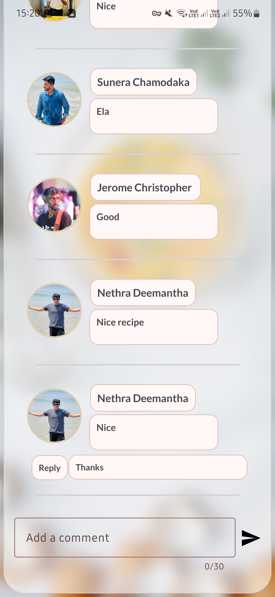

# TheCookBookApp
TheCookBook is an Android app that helps users save, find, and filter recipes. It’s designed for three types of users: regular users, influencers, and admins. Regular users can search for and save their favorite recipes, while influencers can share their own. Admin manage everything to keep the app running smoothly.





Check images folder for more images

## Key Features
### User Functionality
- Recipe search
- Tts function for recipe instructions
- Timer for recipe instructions
- Filtering by category (e.g., vegetarian, non-vegetarian)
- Saving favorite recipes
- User profile management
- Subscribe to influencers
- Watch recipe video

### Influencer Functionality
- Adding new recipes
- Viewing recipe statistics (likes, comments)
- Managing their culinary content

### Admin Functionality
- Managing recipes, users, and influencers
- Viewing platform statistics

### Manual Testing
- Extensive manual testing was performed, focusing on functional testing based on user types and their specific functionalities.

### Offline Access
- The application uses SQLite to ensure users can access recipes even without an internet connection.

## Technologies Used
- **Android Studio**
- **Java**
- **SQLite**
- **Material Design Components**
- **Blurry Library**

## Installation
1. Clone the repository:
   ```bash
   git clone https://github.com/Buddhi2003/TheCookBookApp.git
2. Add the SQLite Database File:
    Obtain the SQLite Database File: You can see the databse file in databse folder(CookBookDB.File).
    Add that to the emulator or your device using device manager option. In the device manager go to data->data
    then find application name and find databse folder. then remove the existing db file and upload the database file.

3. Ensure all dependencies are installed.

4. Run the project on an Android device or emulator.
